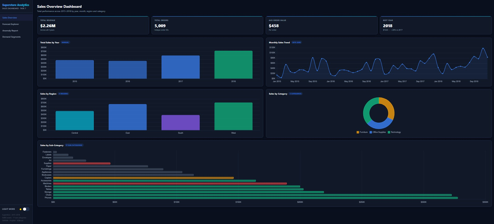

#  📊 Superstore Sales Intelligence Dashboard

An end-to-end **Sales Forecasting and Demand Intelligence System** built using **Python, Machine Learning, and Streamlit**. This project analyzes historical Superstore sales data, forecasts future demand, detects anomalies, segments products based on demand, and provides an interactive dashboard to support data-driven business decisions.

---

## 🌐 Live Dashboard 

🚀 Explore the interactive dashboard here:

**https://superstore-analytics-app.netlify.app/**

---

## 📓 Google Colab

Run the complete project directly in **Google Colab** without installing any software locally.

### 🚀 Open in Google Colab

[](https://colab.research.google.com/drive/1s-TdLNkgoUUQ0b6WKYarN_jcgth7auOk#scrollTo=gxeVFkBh3ljQ)

Or access it directly:

**https://colab.research.google.com/drive/1s-TdLNkgoUUQ0b6WKYarN_jcgth7auOk#scrollTo=gxeVFkBh3ljQ**

### 📚 Notebook Includes

- 📥 Data Loading & Preprocessing
- 📊 Exploratory Data Analysis (EDA)
- 📈 Time Series Analysis
- 🔮 Sales Forecasting (SARIMA, Prophet & XGBoost)
- 🚨 Anomaly Detection using Isolation Forest
- 🎯 Product Demand Segmentation using K-Means Clustering
- 📉 Model Performance Evaluation
- 📋 Business Insights & Recommendations

---

## 📌 Features

- 📈 Interactive Sales Performance Dashboard
- 🔮 3-Month Sales Forecasting
- 📊 Sales Trend Analysis
- 🌍 Regional & Category-wise Analysis
- 🚨 Anomaly Detection using Isolation Forest
- 🎯 Product Demand Segmentation using K-Means Clustering
- 📅 Time Series Decomposition
- 📦 Executive Business Insights
- 📉 Forecast Comparison Across Models
- 📊 Interactive Charts with Plotly

---

## 🛠️ Tech Stack

### Programming Language
- Python

### Data Analysis
- Pandas
- NumPy

### Machine Learning
- Scikit-learn
- XGBoost
- Prophet
- Statsmodels

### Visualization
- Plotly
- Matplotlib

### Deployment
- Streamlit
- Netlify

---

## 📂 Project Structure

```text
Superstore-Sales-Intelligence-Dashboard/
│
├── app.py
├── requirements.txt
├── train.csv
├── notebooks/
├── models/
├── images/
├── reports/
└── README.md
```

---

## 📊 Dashboard Overview

The dashboard provides:

- 📈 Sales KPI Overview
- 📅 Monthly & Yearly Sales Trends
- 🛍️ Category-wise Performance
- 🌍 Regional Sales Analysis
- 🔮 Future Sales Forecast
- 🎯 Product Demand Segmentation
- 🚨 Anomaly Detection Report
- 📊 Interactive Business Visualizations

---

## 🤖 Machine Learning Models

| Model | Purpose |
|-------|---------|
| SARIMA | Time Series Forecasting |
| Prophet | Seasonal Sales Forecasting |
| XGBoost | Machine Learning Forecasting |
| Isolation Forest | Anomaly Detection |
| K-Means | Product Demand Segmentation |

---

## 📈 Business Insights

This project helps businesses:

- Forecast future sales demand
- Optimize inventory planning
- Identify high-demand products
- Detect unusual sales behavior
- Improve supply chain decisions
- Support executive decision-making using data

---

## 🚀 Installation

### Clone the Repository

```bash
git clone https://github.com/tamil1208/Superstore-Sales-Intelligence-Dashboard.git
```

### Navigate to the Project

```bash
cd Superstore-Sales-Intelligence-Dashboard
```

### Install Dependencies

```bash
pip install -r requirements.txt
```

### Run the Streamlit App

```bash
streamlit run app.py
```

---

## 📸 Project Screenshots

Add screenshots of:

- Dashboard Home
- Sales Forecast
- Regional Analysis
- Demand Segmentation
- Anomaly Detection

inside the `images/` folder and reference them here.

Example:

Dashboard Preview



*Interactive Sales Intelligence Dashboard built with Streamlit, featuring KPI cards, sales trends, forecasting, anomaly detection, and demand segmentation.*
```

---

## 📊 Dataset

- **Dataset:** Superstore Sales Dataset
- Includes:
  - Orders
  - Sales
  - Profit
  - Discount
  - Region
  - Category
  - Sub-Category
  - Shipping Details

---

## 🎯 Future Improvements

- Real-time sales data integration
- Deep Learning forecasting models (LSTM)
- Customer Segmentation
- Inventory Optimization
- Power BI Dashboard
- Automated Email Reports

---

## 👨‍💻 Author

**Tamilarasan P**

- GitHub: https://github.com/tamil1208
- LinkedIn: https://www.linkedin.com/in/tamilarasan-a2466b274/
- Email: tamilarsan538@gmail.com

---

## 🤝 Contributing

Contributions are welcome!

1. Fork the repository.
2. Create a feature branch.
3. Commit your changes.
4. Push the branch.
5. Open a Pull Request.

---

## 📄 License

This project is licensed under the MIT License.

---

## ⭐ Support

If you found this project useful, please consider giving it a ⭐ on GitHub. It helps others discover the project and motivates future improvements.

**Thank you for visiting this repository! 🚀**
